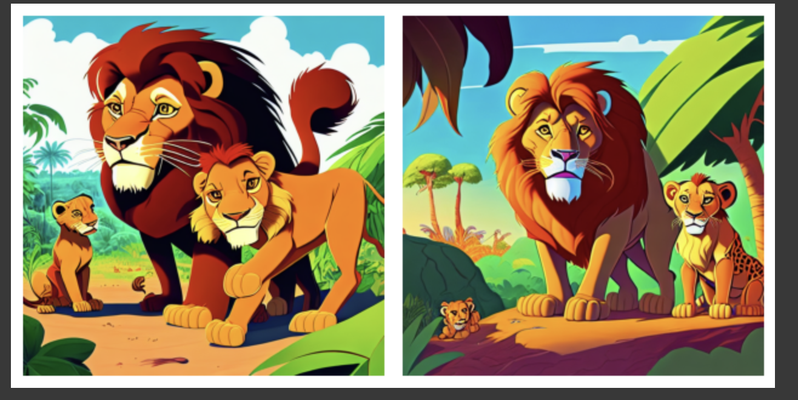
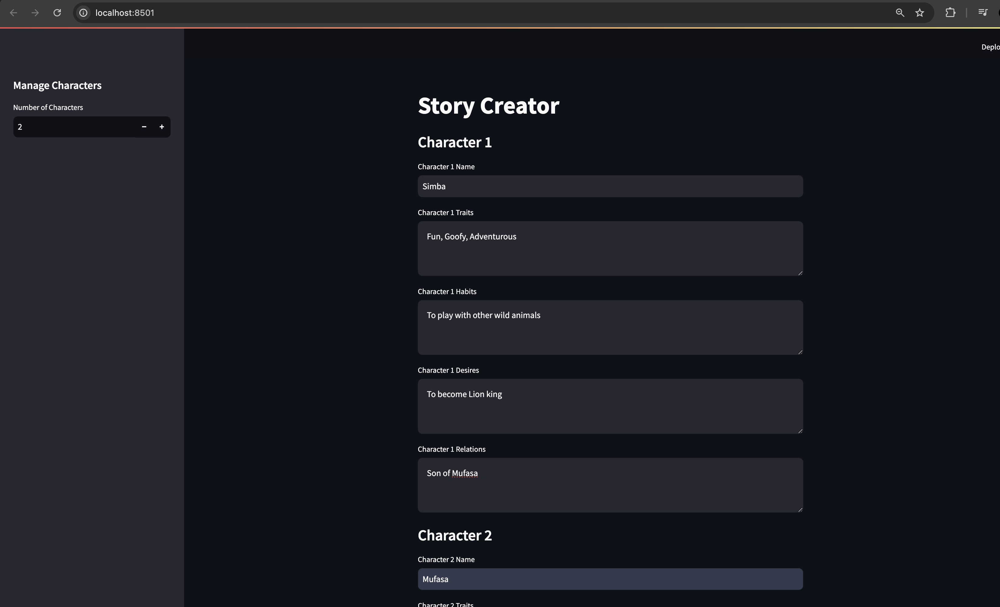
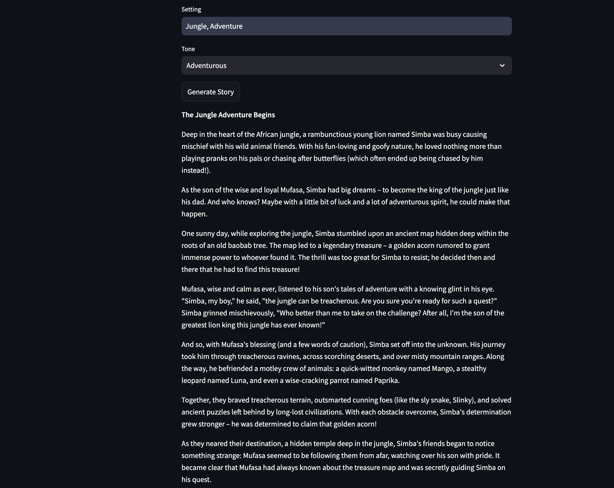

# Story Creator

## Overview

**Story Creator** is an innovative application designed to bring your imaginative stories to life through the power of AI. By integrating character-driven storytelling with visual and audio generation, this tool provides a seamless way to create engaging narratives suitable for children and audiences of all ages. Using advanced models like **Ollama's Llama3** and **Stable Diffusion**, Story Creator allows users to craft stories with vivid character descriptions, dynamic scenes, and immersive settings, all complemented by custom-generated images and audio.



## Features

- **Character Management:** Define your characters with unique traits, habits, desires, and relationships. Manage multiple characters through an intuitive sidebar interface.
- **Story Generation:** Utilize **Llama3** from Ollama to generate compelling narratives based on your character inputs, setting, and desired tone (e.g., humorous, dramatic, mysterious, adventurous).
- **Audio Integration:** Convert the generated story into audio using Google's Text-to-Speech (**gTTS**) for an immersive storytelling experience.
- **Visual Storytelling:** Generate custom illustrations using **Stable Diffusion** to visually represent key moments of your story. These images are designed to match the narrative's tone and setting, providing a complete multimedia experience.




  
## Technology Stack

- **Streamlit:** Provides the interactive user interface for managing characters, settings, and story generation.
- **Ollama Llama3:** A powerful LLM used for creating rich and dynamic stories based on user input.
- **Stable Diffusion:** An AI model for generating detailed illustrations that bring the story scenes to life.
- **gTTS (Google Text-to-Speech):** Converts the generated text into audio, making the story accessible and engaging for children and other audiences.

## How It Works

1. **Character Setup:** Define characters through the sidebar interface by filling in their name, traits, habits, desires, and relationships.
2. **Story Configuration:** Set the story's environment and tone. Choose from various tones to fit your desired narrative style.
3. **Generate Story:** Hit the "Generate Story" button to create a narrative using the character and setting information provided.
4. **Audio Conversion:** Automatically convert the generated story into an audio format for easy listening.
5. **Visual Generation:** Send the story prompt to a Google Colab notebook for image generation using Stable Diffusion, creating visuals for the key moments of your narrative.


## Getting Started

### Prerequisites

- Python 3.8 or higher
- Streamlit
- Ollama Llama3
- Google Text-to-Speech (gTTS)
- Stable Diffusion setup on Google Colab

### Installation

1. Clone the repository:
   ```bash
   git clone https://github.com/yourusername/story_creator.git
